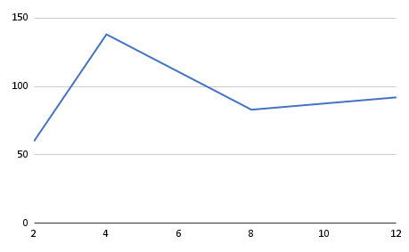
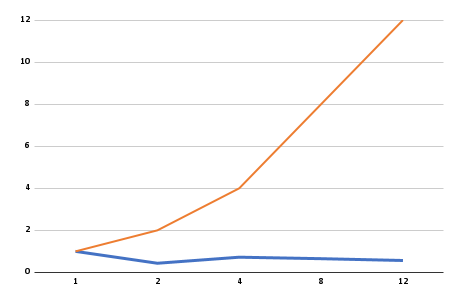
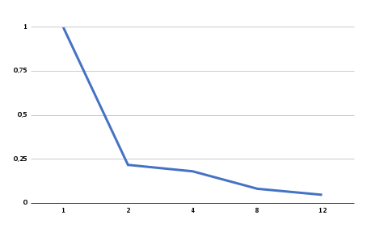

# Relatório da atividade 2
**Disciplina: Programação Concorrente e Distribuída**
**Aluno(s): Naylanne Lissa Gomes Cunha**
**Turma: SIN04M1**
**Professor: Rafael Marconi Ramos**
**Data: 13/03/2026**

---

# 1. Descrição do Problema

* Problema implementado: solução serial e paralela (com 2,4,8 e 12 threads) para somar e calcular o tempo de processamento.

* Algoritmo utilizado: algoritmo de soma sequencial de elementos de um vetor.

* Tamanho da entrada utilizada nos testes: na fase de desenvolvimento foram utilizados 1.000.000 (um milhão) de números com a soma esperada: -88, enquanto que na fase de análise foram utilizados 10.000.000 (dez milhões) de números com a soma esperada: 5384.

* Objetivo da paralelização: reduzir o tempo de execução do algoritmo, dividindo o trabalho entre múltiplos processos que executam simultaneamente.

* O algoritmo utilizado possui complexidade O(n), tanto na versão serial quanto na paralela, porque todos os elementos do vetor precisam ser percorridos ao menos uma vez para o cálculo da soma.

---

# 2. Ambiente Experimental

* Software: Visual Studio Code (VSCode).

* Linguagem: Python 3.14.2

* Modelo: O modelo utilizado foi baseado na divisão de dados entre múltiplos processos, onde cada processo calcula uma parte da soma e, ao final, os resultados são combinados.

* Hardware: Máquina com múltiplos núcleos.

| Item                        |   Descrição   |
| --------------------------- |   ---------   |
| Processador                 |   i5-1135G7   |
| Número de núcleos           |       4       |
| Memória RAM                 |      8gb      |
| Sistema Operacional         |  Windows 11   |
| Linguagem utilizada         |    Python     |
| Biblioteca de paralelização |multiprocessing|
| Compilador / Versão         | VScode 1.112.0|

---

# 3. Metodologia de Testes

* O tempo de execução foi medido utilizando a função time.time() da biblioteca padrão do Python, que retorna o tempo atual em segundos. O tempo total foi calculado pela diferença entre o instante inicial e o instante final da execução do algoritmo.

* Foi realizada uma execução para cada configuração de paralelismo (2, 4, 8 e 12 processos) para ambos arquivos.

### Configurações testadas

Os experimentos foram realizados nas seguintes configurações:

* 1 thread/processo (versão serial)
* 2 threads/processos
* 4 threads/processos
* 8 threads/processos
* 12 threads/processos

### Procedimento experimental

* A máquina foi dedicada, pois durante os testes não havia outros programas pesados em execução, garantindo que o processador estivesse focado na tarefa.

* Carga do sistema: mínima, apenas serviços essenciais do sistema operacional.

* Arquivos de teste: numero1.txt e numero2.txt.

---

# 4. Resultados Experimentais


| Nº Threads/Processos | Tempo de Execução (s) |
| -------------------- | --------------------- |
| 1                    |          45           |
| 2                    |          36           |
| 4                    |          30           |
| 8                    |          38           |
| 12                   |          53           |

---

# 5. Cálculo de Speedup e Eficiência

## Fórmulas Utilizadas

### Speedup

```
Speedup(p) = T(1) / T(p)
```

Onde:

* **T(1)** = tempo da execução serial
* **T(p)** = tempo com p threads/processos

### Eficiência

```
Eficiência(p) = Speedup(p) / p
```

Onde:

* **p** = número de threads ou processos

---

# 6. Tabela de Resultados

Preencha a tabela abaixo utilizando os tempos medidos.

| Threads/Processos | Tempo (s) | Speedup | Eficiência |
| ----------------- | --------- | ------- | ---------- |
| 1                 |    60     |   1.0   |    1.0     |
| 2                 |   138     |   0.4   |    1.03    |
| 4                 |    83     |   0.7   |    0.93    |
| 8                 |    92     |   0.7   |    0.68    |
| 12                |   103     |   0.6   |    0.50    |

---

# 7. Gráfico de Tempo de Execução

* Eixo X: número de threads/processos
* Eixo Y: tempo de execução (segundos)



---

# 8. Gráfico de Speedup

* Eixo X: número de threads/processos
* Eixo Y: speedup



---

# 9. Gráfico de Eficiência

Construa um gráfico mostrando a **eficiência da paralelização**.

## Orientações

* Eixo X: número de threads/processos
* Eixo Y: eficiência
* Valores entre 0 e 1

Inserir o gráfico abaixo:



---

# 10. Análise dos Resultados

* O speedup obtido foi inferior ao ideal e menor que 1, indicando que a versão paralela apresentou desempenho pior que a versão serial. Idealmente, espera-se que o speedup seja próximo ao número de processos utilizados (por exemplo, speedup ≈ 4 para 4 processos). No entanto, os resultados mostraram degradação de desempenho devido ao overhead da paralelização.
* A aplicação não apresentou boa escalabilidade, pois o aumento do número de processos não resultou em redução do tempo de execução, observou-se aumento no tempo conforme mais processos foram adicionados, indicando que o custo adicional superou os benefícios do paralelismo.
* A eficiência começou a cair já a partir da utilização de 2 processos, onde o tempo paralelo já foi significativamente maior que o tempo serial. O desempenho continuou piorando com 4, 8 e 12 processos.
* O número de threads/processos ultrapassa o número de núcleos físicos da máquina ocorrendo o aumento do custo de gerenciamento e perda de desempenho.
* Houve overhead significativo, causado principalmente por criação de processos, divisão dos dados e comunicação e agregação dos resultados, o que impactou diretamente no desempenho final.
* A perda de desempenho ocorreu porque o custo de paralelização foi maior do que o tempo economizado na execução da soma, já  que como a operação é simples o processamento serial seria suficiente sem a quebra dos processos.
* O principal gargalo é que o algoritmo é muito simples (baixa carga computacional), o que não justifica o uso de paralelismo.
* Apesar de mínima, há sincronização no momento de aguardar o término dos processos e combinar as somas parciais o que contribui para o overhead total.
* No multiprocessing, há cópia de dados entre processos, o que é caro em termos de tempo e memória, sendo um dos principais fatores de perda de desempenho.
* Pode ocorrer competição por acesso à memória e perda de eficiência de cache.

---

# 11. Conclusão

* O experimento demonstrou que o uso de paralelismo nem sempre resulta em melhoria de desempenho.
* No caso analisado, a versão paralela apresentou tempos superiores à versão serial devido ao alto custo de criação e gerenciamento dos processos, além da comunicação entre eles.
* O paralelismo não trouxe ganho significativo, apresentando, na maioria dos casos, desempenho inferior ao serial.
* Entre os testes realizados, o melhor desempenho paralelo ocorreu com 4 processos, embora ainda inferior à execução serial.
* O programa não escala bem, pois o aumento do número de processos não melhora o desempenho.
* Algumas melhorias possíveis incluem utilizar problemas com maior carga computacional, reduzir o custo de criação de processos, evitar cópia excessiva de dados, utilizar bibliotecas mais eficientes (ex: NumPy), implementar paralelismo em linguagens com menor overhead (como C/C++) e trabalhar com processamento em blocos (chunks) mais eficientes.
* Os resultados evidenciam que a paralelização deve ser aplicada de forma criteriosa, sendo mais eficiente em problemas computacionalmente intensivos, nos quais o custo do paralelismo é compensado pelo ganho de desempenho.

---